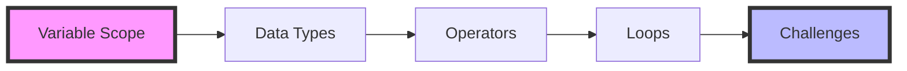
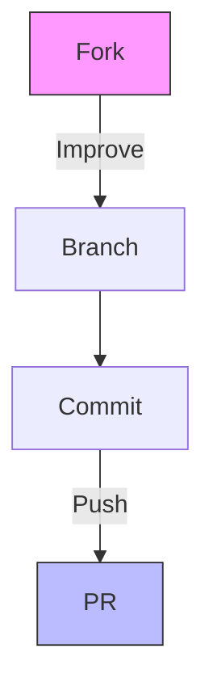

# 🚀 C# Learning Journey

> Master C# through interactive learning and hands-on practice


Welcome to a modern approach to learning C# programming! This carefully crafted learning path takes you from fundamentals to practical applications through interactive examples and real-world challenges.

## 🎯 What's Inside



## 📚 Learning Path

### 1️⃣ Section A: Variable Scope
> Understanding the foundations of variable management
- 🔍 Local vs Global Variables
- 🎯 Method Parameters & Scope
- 📦 Block-level Scope
- ⚡ Live Examples & Practice

### 2️⃣ Section B: Data Types
> Mastering C#'s type system
- 💾 Value Types Deep Dive
- 🔄 Reference Types Explained
- 🔀 Type Conversion Magic
- 🎨 Working with Different Types

### 3️⃣ Section C: Operators
> Becoming proficient with C# operators
- ➕ Arithmetic Operations
- 🔍 Comparison & Logic
- 🔧 Bitwise Operations
- 🎮 Special Operators

### 4️⃣ Section D: Loops [NEW!]
> Control flow mastery
- 🔄 Loop Types & Usage
- 🎯 Pattern Creation
- 🔍 Input Validation
- 🧮 Algorithm Implementation

## 🛠️ Project Structure

```
CSharpLearning-Journey/
├── 📂 src/
│   ├── 🎯 CSharpLearning/    # Entry point
│   ├── 📘 SectionA/          # Variable Scope
│   ├── 📗 SectionB/          # Data Types
│   ├── 📙 SectionC/          # Operators
│   ├── 📕 SectionD/          # Loops
│   └── 🏆 Challenges/        # Practice
└── 📚 docs/                  # Documentation
```

## 🚀 Quick Start

### Prerequisites
- [.NET 8.0 SDK](https://dotnet.microsoft.com/download/dotnet/8.0)
- [Visual Studio Code](https://code.visualstudio.com/) + [C# Extension](https://marketplace.visualstudio.com/items?itemName=ms-dotnettools.csharp)

### Launch Your Learning Journey

```bash
# Clone & Navigate
git clone https://github.com/NickiMash17/CSharpLearning-Journey.git
cd CSharpLearning-Journey

# Run Any Section
dotnet run --project src/SectionD  # Try our newest section!
```

## 💡 Interactive Learning Features

| Feature | Description |
|---------|------------|
| 🎯 Live Examples | Run and modify real code |
| 📝 Challenges | Test your understanding |
| 🔄 Progressive Learning | Build knowledge step by step |
| 🎮 Interactive Demos | Learn by doing |

## 🎓 Learning Tips

1. **📚 Read**: Start with section documentation
2. **💻 Code**: Run and modify examples
3. **🔄 Practice**: Complete all challenges
4. **🎯 Create**: Build your own mini-projects
5. **📝 Document**: Take notes on new concepts

## 🗺️ Future Roadmap

- [ ] Arrays & Collections
- [ ] Methods & Functions
- [ ] Object-Oriented Programming
- [ ] LINQ & Lambda Expressions
- [ ] Async Programming

## 🤝 Contributing

We welcome contributions! See our [Contributing Guide](CONTRIBUTING.md) for details.



## 📫 Support

- 📖 Check documentation
- 💬 Open an issue
- 🌟 Star the repo if helpful

## 📄 License

MIT © [Nicolette Mashaba]

---

<div align="center">

**Happy Coding! Let's master C# together! 🚀**

[](https://github.com/NickiMash17)

</div>