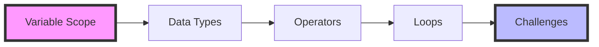
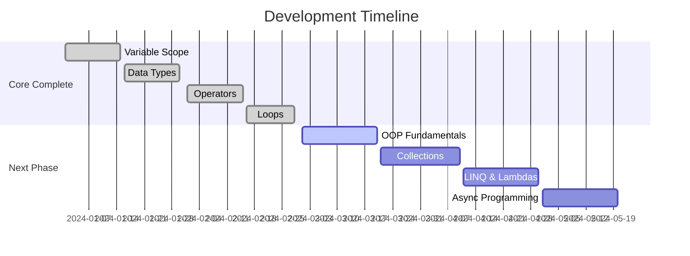
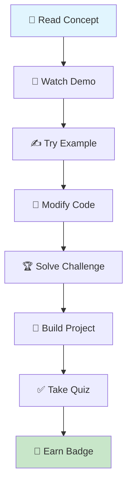
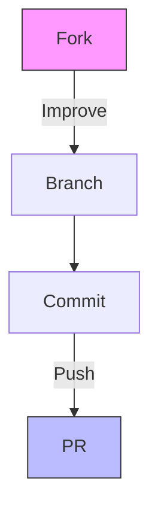

# 🌟 C# Learning Journey
> **Master C# through interactive coding adventures**  
> *From fundamentals to real-world applications - one concept at a time*

<div align="center">


</div>

<div align="center">
  
</div>

## 🎯 Why This Journey?

This isn't just another C# tutorial - it's a **carefully crafted learning experience** designed to build your programming skills through:

- 🎮 **Interactive Examples** - Learn by doing, not just reading
- 🏆 **Progressive Challenges** - Each section builds on the previous
- 🔍 **Real-World Focus** - Practical skills you'll actually use
- 📊 **Visual Learning** - Diagrams and examples that make sense

## 🗺️ Learning Roadmap



## 📚 Curriculum Deep Dive

### 🎓 Core Foundations

<table>
<tr>
<td width="50%">

#### 🔍 **Section A: Variable Scope**
*Understanding the building blocks*

- 🏠 Local vs Global Variables
- 📦 Method Parameters & Scope  
- 🔒 Block-level Scope Rules
- ⚡ Memory Management Basics

**What you'll build:** Scope Analyzer Tool  
📖 **[Read Documentation](docs/SectionA.md)**

</td>
<td width="50%">

#### 🧮 **Section B: Data Types**
*Mastering C#'s type system*

- 💾 Value Types Deep Dive
- 🔗 Reference Types Explained
- 🔄 Type Conversion Strategies
- 🎨 Custom Type Creation

**What you'll build:** Type Converter Utility  
📖 **[Read Documentation](docs/SectionB.md)**

</td>
</tr>
<tr>
<td width="50%">

#### ⚙️ **Section C: Operators**
*Power tools for data manipulation*

- ➕ Arithmetic & Assignment
- 🔍 Comparison & Logical
- 🔧 Bitwise Operations  
- 🌟 Null-coalescing & More

**What you'll build:** Expression Evaluator  
📖 **[Read Documentation](docs/SectionC.md)**

</td>
<td width="50%">

#### 🔁 **Section D: Loops**
*Control flow mastery*

- 🎯 For, While, Do-While
- 🎨 Pattern Generation
- ✅ Input Validation Loops
- 🧮 Algorithm Implementation

**What you'll build:** Pattern Generator App  
📖 **[Read Documentation](docs/SectionD.md)**

</td>
</tr>
</table>

### 🚀 Coming Soon



## 🏗️ Project Architecture

```
CSharpLearning-Journey/
├── 📂 src/
│   ├── 🎯 CSharpLearning/        # Main entry point
│   ├── 📘 SectionA-Variables/    # Variable scope mastery
│   ├── 📗 SectionB-DataTypes/    # Type system deep dive
│   ├── 📙 SectionC-Operators/    # Operator proficiency
│   ├── 📕 SectionD-Loops/        # Control flow mastery
│   └── 🏆 Challenges/            # Progressive challenges
├── 📚 docs/                      # Learning materials
├── 🧪 tests/                     # Unit tests for validation
└── 🎮 interactive/               # Playground projects
```

## 🚀 Quick Start Guide

### 📋 Prerequisites

| Requirement | Version | Download Link |
|-------------|---------|---------------|
| .NET SDK | 8.0+ | [Download](https://dotnet.microsoft.com/download/dotnet/8.0) |
| VS Code | Latest | [Download](https://code.visualstudio.com/) |
| C# Extension | Latest | [Install](https://marketplace.visualstudio.com/items?itemName=ms-dotnettools.csharp) |

### 💨 Lightning Setup

```bash
# 1️⃣ Clone the adventure
git clone https://github.com/NickiMash17/CSharpLearning-Journey.git
cd CSharpLearning-Journey

# 2️⃣ Verify your setup
dotnet --version

# 3️⃣ Start your journey (choose your path!)
dotnet run --project src/SectionA     # Begin with variables
dotnet run --project src/SectionD     # Jump to loops (newest!)

# 4️⃣ Run all tests
dotnet test
```

## 🎮 Interactive Learning System

<div align="center">



</div>

### 🏅 Achievement System

| Badge | Requirement | Reward |
|-------|-------------|---------|
| 🔰 **Variable Ninja** | Complete Section A | Understanding scope like a pro |
| 🎯 **Type Master** | Complete Section B | Data type fluency |
| ⚙️ **Operator Guru** | Complete Section C | Expression expertise |
| 🔁 **Loop Legend** | Complete Section D | Control flow mastery |
| 🏆 **C# Champion** | Complete all sections | Ready for advanced topics! |

## 💡 Learning Philosophy

```csharp
public class LearningApproach 
{
    public string Method => "Learn by Doing";
    public string Focus => "Practical Applications";
    public string Pace => "Your Own Speed";
    
    public void Learn()
    {
        while (curious)
        {
            ReadConcept();
            PracticeExample();
            SolveChallenges();
            BuildProjects();
        }
    }
}
```

### 📚 Quick Access to Documentation
- 📖 [Section A: Variable Scope](docs/SectionA.md)
- 📖 [Section B: Data Types](docs/SectionB.md)  
- 📖 [Section C: Operators](docs/SectionC.md)
- 📖 [Section D: Loops](docs/SectionD.md)
- 🏆 [Challenges Guide](docs/Challenges.md)
- 🎯 [Getting Started Guide](docs/GettingStarted.md)

## 🤝 Contributing to the Journey

We welcome fellow travelers! Here's how to join:

### 🌟 Ways to Contribute

- 🐛 **Bug Reports** - Help us improve
- 💡 **Feature Ideas** - Suggest new learning modules
- 📝 **Documentation** - Make learning clearer
- 🧪 **More Challenges** - Create practice problems
- 🎨 **UI/UX** - Enhance the learning experience

### 🔄 Contribution Flow



1. **🍴 Fork** the repository
2. **🌿 Branch** (`git checkout -b feature/amazing-addition`)
3. **✨ Commit** (`git commit -m 'Add amazing learning feature'`)
4. **🚀 Push** (`git push origin feature/amazing-addition`)
5. **🎉 PR** - Open a Pull Request with detailed description

## 📊 Learning Analytics

Track your progress with built-in analytics:

```
🎯 Concepts Mastered: ████████░░ 80%
🏆 Challenges Solved: ██████░░░░ 60%  
🔥 Current Streak: 7 days
⭐ Overall Score: 850/1000
```

## 📞 Get Help & Support

<div align="center">

| Need Help? | Contact Method |
|------------|----------------|
| 🐛 **Bug Reports** | [Create Issue](https://github.com/NickiMash17/CSharpLearning-Journey/issues) |
| 💬 **Questions** | [Discussions Tab](https://github.com/NickiMash17/CSharpLearning-Journey/discussions) |
| 📧 **Direct Contact** | nene171408@gmail.com |
| 🌟 **Show Support** | Star this repository! |

</div>

## 📜 License & Credits

MIT © [Nicolette Mashaba]

### 🙏 Acknowledgments

- Created with ❤️ by **Nicolette Mashaba**
- Built for the C# learning community
- Inspired by interactive coding education

---


<div align="center">

### 🚀 Ready to Begin Your C# Journey?

**Click the star ⭐ to bookmark this adventure!**

```csharp
Console.WriteLine("Welcome to your C# journey!");
Console.WriteLine("May your code compile and your bugs be few! 🐛✨");
```

[](https://github.com/NickiMash17)

</div>

## Section D - Advanced C# Concepts

### Projects

#### Banking System Demo
A comprehensive banking application demonstrating advanced C# concepts:
- 🏦 Console-based banking system with intuitive UI
- 💰 Account balance management with transaction validation
- 🔒 Secure input handling and error management
- 🎨 Enhanced user experience with color-coded interface

**Key Learning Points:**
- Object-oriented programming principles
- Exception handling and input validation
- Console UI/UX design patterns
- String formatting and interpolation
- Control structures implementation

**Try it out:**
```bash
cd src/SectionD/BankingSystem
dotnet run
```
